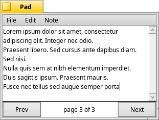

# Pad

### What is Pad?

Pad is a freeware notepad program. Anyone who has used Apple's Notepad app (included with the system software) should find it familiar. It supports multiple pages, the standard text editing commands (Cut, Copy, Paste), as well as Drag 'n' Drop editing.

# Installation

Pad does not require any installation. You can put the Pad file anywhere you want. The first time it is launched, it will create a file called Pad_default in /boot/system/settings. This file will be opened automatically whenever you launch Pad without specifying a document. If you delete this file, it will be automatically created the next time you run Pad.

### Usage

Run the program. Type stuff. Press the buttons. It's not rocket-science :-)

NOTE: Information such as the length of each page is stored in attributes. So if the attributes get trashed somehow (rmattr, moving to a non-Be filesystem, etc.), Pad will no longer open the files. However, you should still be able to open the file in a text editor such as StyledEdit. The pages will all be run together, but the text will all be there.

### Multiple pads

Pad can only have one file open at a time; however, you can have multiple instances of Pad open at once, each with a different file.  To create multiple pads, just duplicate the file "Pad_default" in /boot/system/settings, and rename/move it wherever you want. Just double-click this file to open it in Pad. *
* At this time, double-clicking does not work. I believe this to be a problem with AAPR, but I'm still looking into it. However, you can still open non-default pad files in two ways:
	1) from the command line: "Pad my_pad &" where 'my_pad' is the name of your pad file.
	2) by dragging the pad file onto the Pad icon.

### Future improvements

• Double-click to open pad files. This is my top priority.

• If you resize the window quickly, you'll see a "rubber-band" effect on the window elements. This should be gone within a week or so, although a solution I'm happy with will probably take a little longer. Also, I plan to make the interface look a bit better -- I consider it quite ugly right now.

• Multiple pads open with a single instance of the app.

• Remember window location/size.

• Allow user to configure default pad location. This will probably happen as soon as one of the several preferences managers becomes a de facto standard.

• Allow import of text files.

• More editing commands, e.g. Select All, Clear, possibly Undo.

• Clicking on page number brings up dialog box that allows jumping to any page.

### Known Bugs

None that I know of. I'm sure I'll hear about a whole bunch as soon as other people get their hands on it though.

### Legal stuff

Pad is freeware. I certainly don't mind donations to my college fund, but I'll feel guilty if you give me more than $5 for this :-). You can distribute it freely, as long as 1) this file accompanies it, 2) neither file is modified in any way, and 3) you don't charge more than the cost of distribution. If you want to include this with a commercial product, please get my permission first.

As always, I am not legally responsible for any damage caused directly or indirectly by this application. Use it at your own risk.

### Misc.

If you have any comments (good or bad), I would really like to hear them. Bug reports and suggestions for improvement are especially welcome.

### Contact info
email: slrx7@cc.usu.edu
phone: (801) 379-3052 (till the end of August)
snail mail:
	Jesse Hall
	2650 Ross Avenue
	Idaho Falls, ID 83406